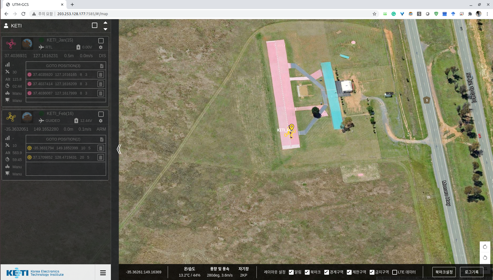
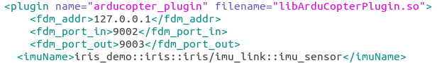
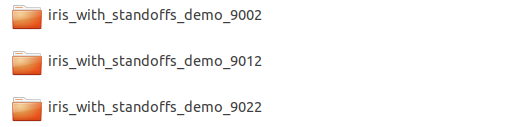

# ArduSwarmSim
## Ardupilot based UAV Swarm + Gazebo simulator
### This is an instruction for using KETI GCS + nCube_MUV + Ardupilot + Gazebo
### This is for Non-ROS users



### Web GCS by [Autonomous IoT Research Center @ KETI](https://github.com/IoTKETI)


## 1. Prerequisites
1.1 **Ubuntu** and **ROS**

Ubuntu 64-bit 18.04., ROS Melodic. [ROS Installation](http://wiki.ros.org/ROS/Installation) (Not essential)


1.2 **ardupilot**

Follow the instructions: [ardupilot](https://github.com/ArduPilot/ardupilot)


1.3. **Install ardupilot_gazebo plugin**

Follow the instructions: [ardupilot_gazebo](https://github.com/SwiftGust/ardupilot_gazebo)


1.4. **Gazebo 8 or 9**

Make sure you run Gazebo at leat once.
```
    gazebo --verbose iris_arducopter_demo.world
```

1.5 **Modify the model & world files**

For multi-UAVs, you need to edit the "model.sdf" and ".world" files.
```
    cd ~/path_to_[ardupilot_gazebo]/models/iris_with_standoffs_demo
    gedit model.sdf
```
Find "arducopter_plugin", and edit as shown in below Figure:




In addition, you need to clone the model folder in the same path as follow:



In each folder, model.sdf should be editted. Each new instance of SITL is created in ports skipped by 10 units to each other.
So, simply add "10" in every port to each cloned model. The first model has ports "9002" and "9003", the second will have "9012" and "9013", and the next will have "9022" and "9023".
You can add the UAVs with added ports as much as you want. The modified model.sdf will be as follow:

Second UAV: model.sdf


Third UAV: model.sdf


Then, you need to modify the .world file.
```
    cd ~/path_to_[ardupilot_gazebo]/worlds
    sudo cp iris_ardupilot.world multiuav.world
    sudo gedit multiuav.world
```


