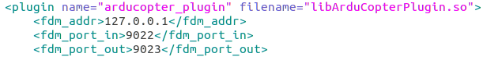
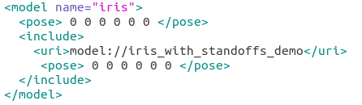

# ArduSwarmSim
## Ardupilot based UAV Swarm + Gazebo simulator
This is an instruction for using KETI GCS + nCube_MUV + Ardupilot + Gazebo.

(This is for Non-ROS users or can be used with ROS)

<iframe width="100%" height="600" src="https://www.youtube.com/watch?v=qKVCXtHBdWo" frameborder="0" allowfullscreen></iframe>


### Web GCS by [Autonomous IoT Research Center @ KETI](https://github.com/IoTKETI)
## http://203.253.128.177:7585/


## 1. Prerequisites
1.1 **Ubuntu** and **ROS**

Ubuntu 64-bit 18.04., ROS Melodic. [ROS Installation](http://wiki.ros.org/ROS/Installation) (Not essential)


1.2 **ardupilot**

Follow the instructions: [ardupilot](https://github.com/ArduPilot/ardupilot)
```
    cd ~/path_to_[ardupilot]
    git submodule update --init --recursive
```

1.3. **Install ardupilot_gazebo plugin**

Follow the instructions: [ardupilot_gazebo](https://github.com/SwiftGust/ardupilot_gazebo)


1.4. **Gazebo 8 or 9**

Make sure you run Gazebo at leat once.
```
    gazebo --verbose iris_arducopter_demo.world
```

1.5 **Modify the model & world files**

For multi-UAVs, you need to edit the **model.sdf** and **.world** files.
```
    cd ~/path_to_[ardupilot_gazebo]/models/iris_with_standoffs_demo
    gedit model.sdf
```
Find **arducopter_plugin**, and edit as shown in below Figure:


In addition, you need to clone the model folder in the same path as follow:


In each folder, model.sdf should be editted. Each new instance of SITL is created in ports skipped by 10 units to each other.
So, simply add **10** in every port to each cloned model. The first model has ports **9002** and **9003**, the second will have **9012** and **9013**, and the next will have **9022** and **9023**.
You can add the UAVs with added ports as much as you want.

Second UAV: **model.sdf**


Third UAV: **model.sdf**




Then, you need to modify the **.world** file.
```
    cd ~/path_to_[ardupilot_gazebo]/worlds
    sudo cp iris_ardupilot.world multiuav.world
    sudo gedit multiuav.world
```
Find below part,



and replace those lines with


then run,

```
    gazebo --verbose multiuav.world
```

You will see this world.


1.6 **Clone the ardupilot source folder**

At the moment, I only tested one by one matching architecture which means you need to run the ardupilot SITL code for each UAV.
In this case, I set 3 UAVs, so you need to have 3 ardupilot SITL code as follows:


Then, you are READY to GO.

## 2. Run

Terminal 1 (9002)

```
    cd ~/ardupilot/Tools/autotest
    ./sim_vehicle.py -v ArduCopter -f gazebo-iris --console -I0 -L Keti --out udpin:127.0.0.1:14551
```

Terminal 2 (9012)

```
    cd ~/ardupilot2/Tools/autotest
    ./sim_vehicle.py -v ArduCopter -f gazebo-iris --console -I1 -L Keti --out udpin:127.0.0.1:14561
```

Terminal 3 (9022)

```
    cd ~/ardupilot3/Tools/autotest
    ./sim_vehicle.py -v ArduCopter -f gazebo-iris --console -I2 -L Keti --out udpin:127.0.0.1:14571
```

Terminal 4 (gazebo)

```
    gazebo --verbose multiuav.world
```


## 3. Etc
3.1 14550 port is basically from MavProxy to GCS.
We can use 14551 port as input from GCS to MavProxy by ```--out udpin:127.0.0.1:14551``` option.

3.2 SITL parameter settings
- set **SYSID_THISMAV** to your UAV ID. It should be same with the number you set in the resource server (either Web GCS).
- set **SERIAL0_PROTOCOL** to **1:MAVlink1** and **SERIAL1_PROTOCOL** to **1::MAVlink1**. Since nCube can parse only MAVLINK 1 protocol at the momnet.
##

